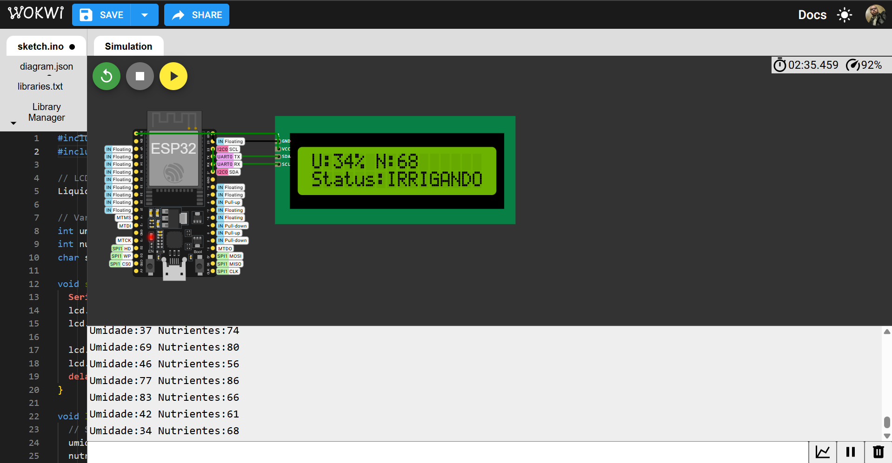
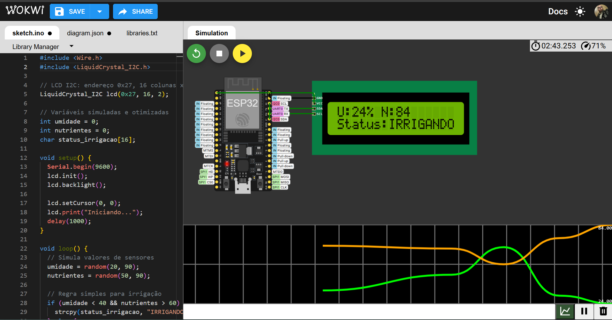
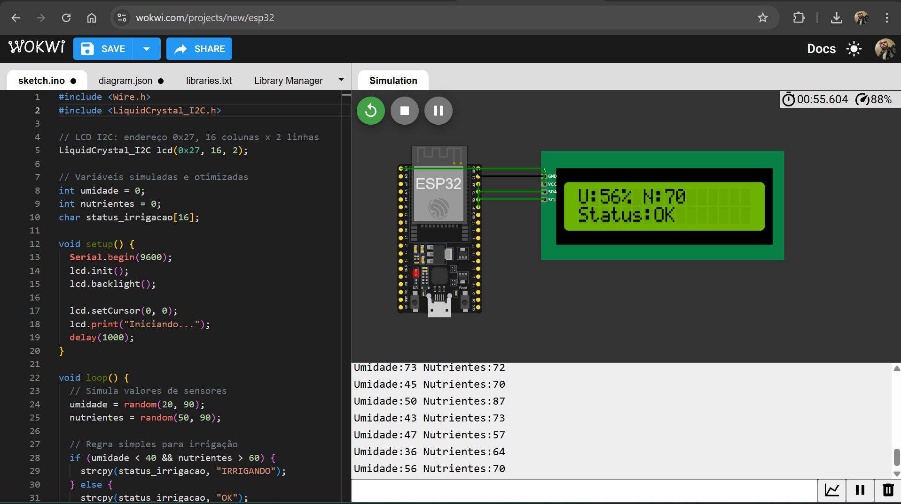
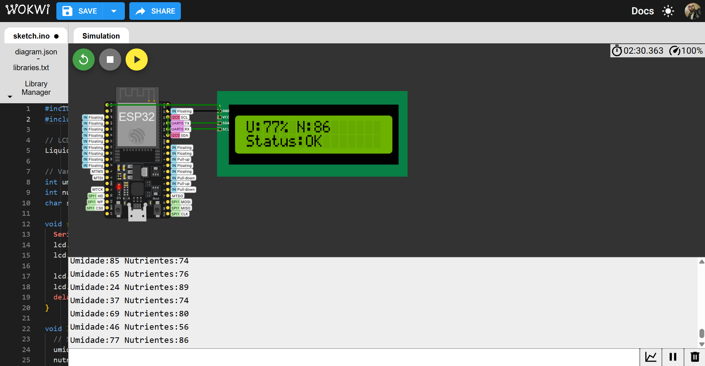
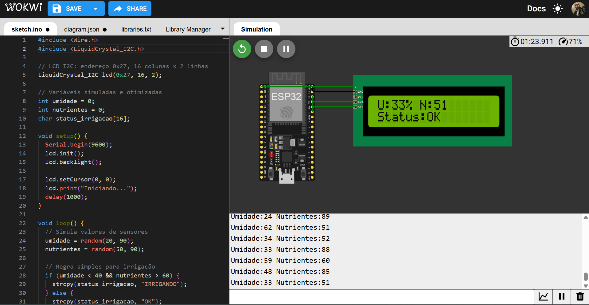
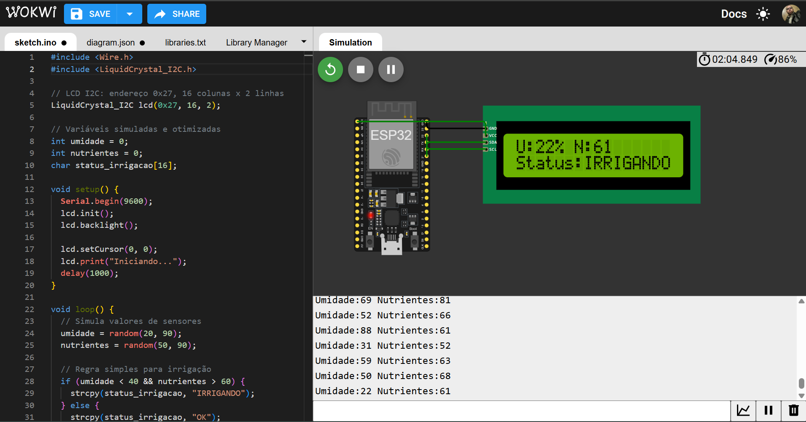

# FIAP - Faculdade de Informática e Administração Paulista

<p align="center">
<a href="https://www.fiap.com.br/"></a>
</p>

<br>

# Automação e inteligência na FarmTech Solutions

## Fase 4 – Cap 1 - FarmTech Solutions  
Período: 21/05/2025 a 20/06/2025

## 👨‍🎓 Integrantes do Grupo 75:
- Deivisson Gonçalves Lima – RM565095 – [deivisson.engtele@gmail.com](mailto:deivisson.engtele@gmail.com)
- Omar Calil Abrão Mustafá Assem – RM561375 – [ocama12@gmail.com](mailto:ocama12@gmail.com)
- Paulo Henrique de Sousa – RM564262 – [pauloo.sousa16@outlook.com](mailto:pauloo.sousa16@outlook.com)
- Renan Danilo dos Santos Pereira – RM566175 – [renansantos4978@gmail.com](mailto:renansantos4978@gmail.com)

## 👩‍🏫 Professores:
### Tutor(a):
- Lucas Gomes Moreira  
### Coordenador(a):
- André Godoi Chiovato  

---

## 📜 Introdução

Nesta nova fase do projeto, a Fase 4 do Enterprise Challenge – FarmTech Solutions, o objetivo foi elevar o nível da aplicação desenvolvida na Fase 3, agregando maior sofisticação tecnológica e inteligência ao sistema de irrigação automatizado. A proposta envolveu integrar recursos avançados como modelagem preditiva, visualização em tempo real e otimização do código embarcado no ESP32.

---

## 🔧 Desenvolvimento

### 💡 Desafio
Integração com Scikit-learn: Desenvolver um modelo preditivo baseado em dados históricos de umidade, nutrientes e hora do dia, permitindo que o sistema antecipe a necessidade de irrigação com base em padrões observados.

Interface interativa com Streamlit: Criação de um dashboard acessível e dinâmico para visualização dos dados coletados, gráficos de variação de métricas e resultado das predições.

Display LCD (I2C): Implementação de um display LCD 16x2 no Wokwi conectado ao ESP32, exibindo em tempo real os principais dados monitorados (umidade, nutrientes, status da irrigação).

Uso do Serial Plotter: Visualização gráfica das variáveis no ambiente Wokwi por meio do Serial Plotter, possibilitando análise contínua do comportamento do sistema.

Otimização de memória no ESP32: Ajustes no código C++ utilizando boas práticas como troca de String por char[], uso de tipos primitivos otimizados (int, float), além de comentários explicativos das melhorias aplicadas.

### 🧠 Soluções Aplicadas
- Modelo de machine learning (Scikit-learn) para prever necessidade de irrigação
- Streamlit dashboard para visualização interativa dos dados e previsões
- Banco de dados SQLite para armazenar leituras dos sensores simulados
- Código otimizado em C++ para ESP32 com display LCD e monitoramento via Serial Plotter


## 📈 Prints do Projeto

### 💧 LCD Exibindo Métricas


### 📉 Serial Plotter


### 🖥️ Simulações adicionais Wokwi

#### Status: IRRIGANDO



#### Status: OK



---

## 📂 Estrutura de Pastas

```
📁FarmTech_Fase4_Cap1/
├─ 📜app.py
├─ 📜README.md
├─ 📜requirements.txt
├─ 📂data/
│   └─ 📜criar_exemplo_db.py
├─ 📂db/
│   └─ sensores.db
├─ 📂models/
│   └─ 📜modelo_irrigacao.pkl
├─ 📂imagens/
│   ├─ 📜lcd_display.png
│   ├─ 📜serial_plotter.png
│   ├─ 📜esp32_simulacao1.png
│   ├─ 📜esp32_simulacao2.png
│   ├─ 📜esp32_simulacao3.png
│   └─ 📜esp32_simulacao4.png
└─ 📂wokwi/
    ├─ 📜sketch.ino
    ├─ 📜diagram.json
    ├─ 📜wokwi_project.json
    ├─ 📜wokwi-project.txt
    └─ 📜libraries.txt
```

---

## 🎥 Demonstração em Vídeo

- 📹 Link do vídeo (não listado): [https://youtube.com/SEU_VIDEO_AQUI](https://youtu.be/If42tjnANio)

---

## 📜 Licença

Este projeto foi desenvolvido para fins acadêmicos no âmbito da FIAP FarmTech Solutions 2025. Todos os direitos relativos a este código e seus componentes são reservados ao(s) autor(es).
